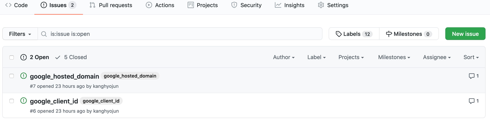
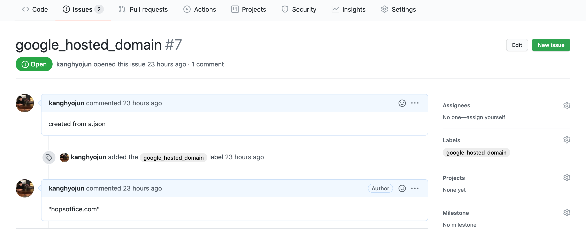

# Galbi

Less important configuration management system.

## Installation

### Requires

- Python 3.6 +
- GitHub personal access token: <https://github.com/settings/tokens>


### Install

Recommend to use [pipx][] to install command line interface in isolated
environment.

```console
$ pip install pipx
$ pipx install galbi
```

[pipx]: https://github.com/pipxproject/pipx


### Initialize configuration

```console
$ galbi init
GitHub repo: ...
Your GitHub personal access token: ...

Initialize galbi.
```


## Migration

In galbi 1.0, we changes a way to store a configuration.
Before 1.0, galbi get a latest comment of issue to get body.
But from galbi 1.0, It stores data in body of issue.

So If you use galbi under 1.0 version, You need to migrate your configuration.

```
$ galbi migrate
Are you sure you want to migrate galbi 0.2 to 1.0? [y/N]:
```

`migrate` command help you to migrate configurations.


## How to deploy key?

It uploads JSON to reposotory's issue.

```console
$ galbi deploy something.json

...
```



JSON key should be a title and label of issue.



JSON value stored in body of the issue, and leaves a comment of the issue
as well.
If someone deploy the same JSON key, value pair, It updates a body and
comment again.

Issue's comment is change log of configuration.

For deploying a single configuration, It supports `deploy-key` command.

```console
$ galbi deploy-key -k foo  -v bar
...
```

## How to get key?

```
$ galbi get --key foo --key bar
{
    "foo": ...,
    "bar": ...,
}
```

To get specific changes of configuration, you can use `get-rev` command.


```
$ galbi get-rev -k foo -r 0
...
```

Note that galbi only get a configuration from an opened issue.
If you want to deprecate/remove the configuration, close the issue.
